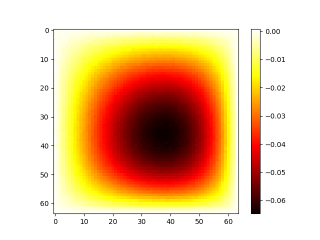
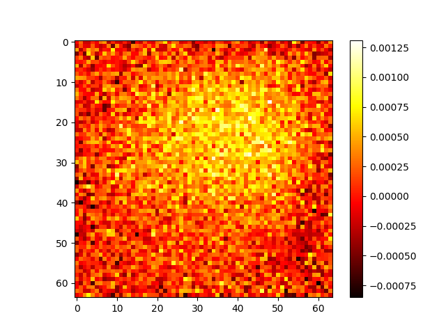

# Conception et évaluation de méthodes ML en physique

Pierre JOURDIN
Aymeric CONTI

## Introduction

On a choisi de considerer le problème de résolution de l'équation de Poisson sur un domaine carré $[0, 1]^2$ :

$$\Delta u(x, y) = -f(x, y), \quad \text{pour } (x, y) \in [0, 1]^2$$

avec les conditions aux limites de Dirichlet homogènes :

$$u(x, y) = 0, \quad \text{pour } (x, y) \in \partial([0, 1]^2)$$

et avec la fonction f définie par :

$$f(x, y) = x sin (a \pi y) + y sin (b \pi x)$$

a et b sont les paramètres a faire varier pour obtenir les différents problèmes de cette famille.

## 1. Simulation par différences finies

On discrétise le domaine à l’aide d’une grille uniforme de taille 64 × 64, soit N = 64 points dans chaque direction. L’espacement entre les points est $(h = \frac{1}{N+1})$.

Nous utilisons la méthode des différences finies centrées pour approximer le Laplacien. Cela donne, pour un point intérieur (i,j) :

$$\Delta u_{i,j} \approx \frac{u_{i+1,j} + u_{i-1,j} + u_{i,j+1} + u_{i,j-1} - 4u_{i,j}}{h^2}$$

Cette approximation conduit à un système linéaire de la forme :

$$A \mathbf{u} = \mathbf{f}$$

où A est une matrice creuse de taille $(N^2 × N^2)$ avec :
- 4 sur la diagonale principale,
- -1 sur les coefficients correspondant aux voisins (haut, bas, gauche, droite), en tenant compte de la structure 2D de la grille.

Voici un exemple de structure pour A (dans le cas N=3 pour la clarté) :

$$
A = \begin{pmatrix}
 4 & -1 &  0 &  0 &  0 &  0 &  0 &  0 &  0 \\
-1 &  4 & -1 &  0 &  0 &  0 &  0 &  0 &  0 \\
 0 & -1 &  4 & -1 &  0 &  0 &  0 &  0 &  0 \\
 0 &  0 & -1 &  4 & -1 &  0 &  0 &  0 &  0 \\
 0 &  0 &  0 & -1 &  4 & -1 &  0 &  0 &  0 \\
 0 &  0 &  0 &  0 & -1 &  4 & -1 &  0 &  0 \\
 0 &  0 &  0 &  0 &  0 & -1 &  4 & -1 &  0 \\
 0 &  0 &  0 &  0 &  0 &  0 & -1 &  4 & -1 \\
 0 &  0 &  0 &  0 &  0 &  0 &  0 & -1 &  4
\end{pmatrix}
$$

La matrice A est construite en utilisant la fonction `kronsum()` de `scipy.sparse`, qui réalise le produit de Kronecker entre deux matrices tridiagonales.

Le système linéaire est résolu grâce à la fonction `spsolve()` de la bibliothèque `scipy.sparse.linalg`, qui est adaptée au traitement de matrices creuses.

---

## 2. Résolution par Réseau de Neurones

Fait office de baseline ML

### 2.1 Principe de la méthode

- Les données d'entraînement et de test sont générées à l'aide de la méthode des différences finies.
- Chaque donnée d'entraînement est constituée de :
  - **Input** : une grille de \( f(x, y) \), calculée via la formule donnée.
  - **Label** : une grille de \( u(x, y) \), solution obtenue par différences finies.
- Un réseau de neurones est entraîné pour approximer la solution \( u \) à partir du champ \( f \).

**Avantages :**
- facile à implémenter
- Prédiction rapide une fois entraîné.

**Inconvénients :**
- Aucune contrainte physique imposée.
- Approxime le résultat donné par les différence finies, qui est déjà une approximation de la réalité

### 2.2 Implémentation

- **Architecture** : réseau de neurones convolutionnel suivi d'une couche dense.
  - 5 couches convolutives avec padding (pas de perte de dimension) et activations ReLU.
  - Une couche dense linéaire en sortie.

- **Fonction de perte** : MSE (Mean Squared Error), classique pour un problème de régression.

---

## 3. Résolution par PINN (Physics-Informed Neural Network)

### 3.1 Principe de la méthode

L’objectif est d’incorporer explicitement la physique du problème dans l’apprentissage du réseau, en forçant le respect de l’équation différentielle.

La structure du réseau est similaire à celle utilisée en apprentissage supervisé, mais la **fonction de perte** inclut maintenant plusieurs composantes :

- **Terme "data"** : MSE entre la sortie du réseau et la solution de référence (comme dans la méthode classique).
- **Terme "résidu EDP"** : calcul des dérivées secondes de la solution prédite, puis MSE entre \(-\Delta u_\theta(x, y)\) et \(f(x, y)\).
- **Terme "conditions aux limites"** : MSE entre la solution du réseau et 0 sur le bord du domaine.

**Avantages :**
- Intégration directe des connaissances physiques.
- Prédiction rapide après entraînement.
- Reste relativement simple à implémenter

**Inconvénients :**
- Approxime le résultat donné par les différence finies, qui est déjà une approximation de la réalité

---

### 3.2 Implémentation

Le terme de conditions aux limites a été supprimé après expérimentation, car il dégradait les performances dans notre cas.
Une étude plus approfondie aurait pu être pertinente, mais nous avons préféré nous focaliser sur la partie concernant le résidu d'EDP dans ce travail.

**Pondérations choisies :**
- Résidu PDE : `1e-7`
- Terme "data" : `1 - 1e-7`
- Terme CL : `0`

Le coefficient de résidu choisi peut sembler faible, mais en réalité c'est ce coefficient qui permet d'avoir des contributions comparables des deux termes de la loss dans la loss finale.

Le coefficient de résidu choisi peut sembler faible, mais en réalité c'est ce coefficient qui permet d'avoir des contributions comparables des deux termes de la loss dans la loss finale.

---

## 4. Résolution par PENN (Physics-Encoded Neural Network)

### 4.1 Principe de la méthode

Le modèle PENN repose sur une approche différente des PINNs : au lieu d’ajouter la physique dans la fonction de perte, on encode directement les contraintes physiques dans l’**architecture du réseau**.

**Imposition des conditions aux limites de manière "hard"** : le réseau est construit de telle sorte que les sorties satisfont exactement les conditions de Dirichlet.

Cette méthode offre un respect plus strict des contraintes physiques.

### 4.2 Implémentation

- **Structure du réseau** : identique à celle utilisée pour le PINN, mais sa sortie est automatiquement contrainte à vérifier $u(x, y) = 0$ sur le bord.

---

## 5. Résultats

Il y a deux comparaisons intéressantes pour juger nos méthodes SciML.
- comparaison au solveur numérique : on attend gain de temps, mais on ne peut pas comparer précision car par définition la précision de la méthode numérique est maximale (c'est ce qu'on a utilisé comme ground truth)
- comparaison au ML pur

### Visualisation des résultats

Visualisation des résultats pour PINN ($\gamma = 1e-7$) :

    
    
    

La figure ci-dessus présente, de gauche à droite :

1. La prédiction du réseau de neurones : on observe la solution $u(x, y)$ prédite à partir du champ $f(x,y)$ donné.
2. La solution physique de référence : obtenue par la méthode des différences finies, elle sert de "ground truth" pour l’entraînement et l’évaluation.
3. L’erreur absolue : différence point par point entre la prédiction du modèle et la solution réelle.

On note que, comme il sera vu plus tard, les résultats de PENN et du NN de base sont très comparables, donc la visualisation est identique.

### Comparaison des temps de calcul

On compare dans le tableau suivant le temps de calcul à l'inférence, donc sans prendre en compte le temps d'entrainement ni de création des données.
On utilise le réseau de la section 2 ici car les autres (sections 3 et 4) ont le même temps d'inférence.

Comme montré dans la visualisation, ces réseaux donnent des résultats que nous considérons satisfaisants à l'oeil nu (bien que nous n'ayons pas de critère quantitatif pour le montrer), donc la comparaison en temps de calcul a du sens.

| Méthode                               | Temps de calcul |
|---------------------------------------|-----------------|
| Résolution physique                   | 8.33 it/s       |
| Réseau de neurones (batch_size = 1)   | 916.87 it/s     |
| Réseau de neurones (batch_size = 64)  | 3072.00 it/s    |

Comme attendu, les méthodes par réseau de neurones sont plus rapides, en revanche il faut aussi prendre en compre la préparation du réseau de neurones (génération des données + entrainement)

Le temps total de préparation pour l'utilisation du réseau de neurones est de 204 secondes (dont 119 secondes pour la génération du dataset et 85 secondes pour l'entraînement).

On peut alors calculer à partir de combien d'inférences il devient intéressant (en temps de calcul uniquement) d'utiliser les réseaux de neurones :

$$204 + \frac{x}{3072} = \frac{x}{8.33} \quad \Rightarrow \quad x \approx 1704$$

Autrement dit, à partir de 1704 prédictions, l'approche par réseau devient plus rapide que la résolution physique directe, temps de préparation inclus.
On peut noter que, sur ces 1704 prédictions :
- 1000 sont dues à la création des données
- environ 700 sont dues à l'entrainement, car le temps d'inférence est assez négligeable.

### Comparaison des erreurs

On compare ici les précisions (MSE, composante data uniquement) de nos modèles.
Comme évoqué précédemment, on ne fait pas apparaitre le solveur numérique car sa loss est 0 par définition.

| Méthode                   | Loss                   |
|---------------------------|------------------------|
| NN                        | $7.2561 \cdot 10^{-5}$ |
| PINN $(\gamma = 10^{-6})$ | $7.2542 \cdot 10^{-5}$ |
| PINN $(\gamma = 10^{-7})$ | $7.2579 \cdot 10^{-5}$ |
| PENN                      | $6.9001 \cdot 10^{-5}$ |

On observe que les PINNs obtiennent des performances comparables au réseau classique pour des hyperparamètres appropriés. Le modèle PENN présente une erreur légèrement plus faible, indiquant un meilleur respect des contraintes physiques.

---

## Conclusion

Dans ce projet, nous avons exploré différentes méthodes pour résoudre l’équation de Poisson sur un domaine carré, en comparant une approche classique par différences finies avec des méthodes d'apprentissage automatique, notamment les réseaux de neurones classiques, les PINNs et les PENNs.

Les principales observations sont les suivantes :

- La méthode des différences finies fournit une solution de référence fiable, mais son coût devient important lorsqu’un grand nombre de problèmes doivent être résolus.
- Le réseau de neurones classique permet des prédictions très rapides une fois entraîné, mais ne respecte pas explicitement les lois physiques sous-jacentes.
- Les PINNs intègrent les connaissances physiques dans la fonction de perte, ce qui permet un certain respect de l’équation différentielle tout en conservant de bonnes performances.
- Les PENNs imposent structurellement les contraintes physiques, ce qui améliore la précision et garantit le respect des conditions aux limites.

Chaque approche a ses avantages :

- **NN classique** : simple, rapide en inférence, mais peu contraint physiquement.
- **PINN** : bon compromis entre apprentissage supervisé et respect de la physique, au prix d’un réglage délicat des pondérations.
- **PENN** : meilleure intégration des contraintes physiques, au prix d’une architecture plus rigide.

En perspective, plusieurs pistes peuvent être envisagées :

- Améliorer l'entraînement des PINNs avec des stratégies plus robustes de pondération adaptative.
- Étendre les modèles à des domaines non réguliers ou à des équations plus complexes.
- Étudier l’hybridation entre méthodes numériques classiques et réseaux informés physiquement, pour tirer parti des forces de chacune.

Ce travail illustre comment les outils d'apprentissage automatique peuvent compléter les méthodes numériques traditionnelles, en particulier dans un contexte de génération rapide de solutions à grande échelle.
